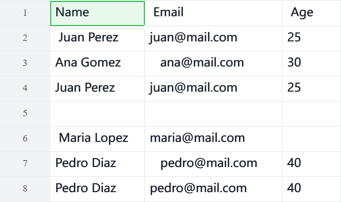
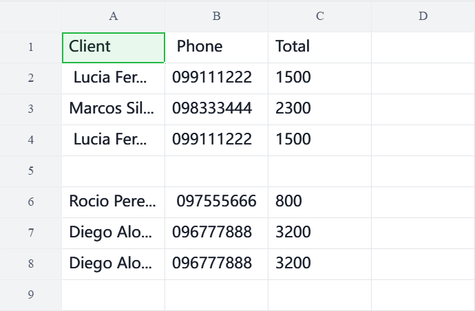
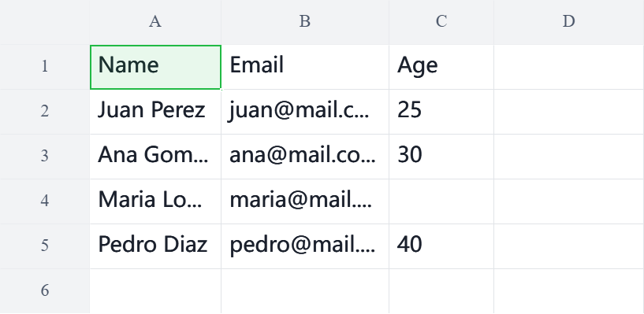
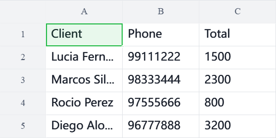

# CSV/Excel Cleaner

Python script that automatically cleans CSV or Excel files with messy data: extra whitespace, empty rows, and duplicate rows.

## What it solves

Everyday spreadsheets (sales, contacts, inventory) often accumulate common issues:
- Extra whitespace in names, emails, etc.
- Completely empty rows
- Duplicate records

This script detects and fixes them automatically, regardless of the column names in the file.

## Usage

```python
from cleaner import file_cleaner

file_cleaner("my_dirty_file.csv", "my_clean_file.csv")
file_cleaner("my_dirty_file.xlsx", "my_clean_file.xlsx")
```

## Requirements
pip install pandas openpyxl

## Example

### Before
| CSV | Excel |
|---|---|
|  |  |

### After
| CSV | Excel |
|---|---|
|  |  |
